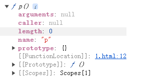
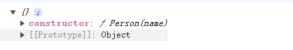
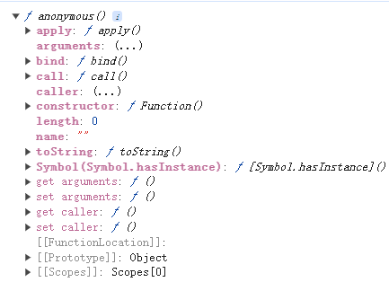

# 原型与原型链的关系梳理

#### 先下结论：

**每个实例对象上的`__proto__`，指向这个构造函数的构造器，然后这个构造函数的构造器`prototype`上有个`__proto__`，它指向的是`Object`上的`prototype`，`Object`的`prototype`上面个`__proto__`属性指向为`null`，这样的一层层关系就形成的原型链**

### prototype 是什么

**`prototype` 叫`原型`也叫`原型对象`是函数上的一个属性**

```js
function p() { }
console.dir(p)
```

它是函数上的一个属性并且是个对象类型的属性



```js
 function Person(name) {
  this.name = name
}
const p1 = new Person()
console.log(p1.prototype) 
```
实例对象上没有这个属性


###  __proto__  是什么 
**`__proto__` 叫`隐式原型`是对象上的属性**
```js
 function Person(name) {
  this.name = name
}
const p1 = new Person()   
console.log(p1.__proto__) 
```


```js
function p() { }
console.dir(p)
```
为什么函数上也有这属性，`__proto__`不是对象上的属性吗？答：**在JavaScript中，函数也是对象**




### 验证原型链关系
```js
function Person(name) {
  this.name = name
}
const p1 = new Person()

console.log('p1.__proto__ === Person.prototype', p1.__proto__ === Person.prototype) // true
console.log('Person.prototype.__proto__ === Object.prototype', Person.prototype.__proto__ === Object.prototype) // true
console.log('Object.prototype.__proto__', Object.prototype.__proto__) // null
```

### 参考文章

+ [https://www.bilibili.com/video/BV1ua4y1C7US/?spm_id_from=333.1007.top_right_bar_window_history.content.click](https://www.bilibili.com/video/BV1ua4y1C7US/?spm_id_from=333.1007.top_right_bar_window_history.content.click)
  
+ [https://vue3js.cn/interview/JavaScript/prototype.html#%E4%B8%80%E3%80%81%E5%8E%9F%E5%9E%8B](https://vue3js.cn/interview/JavaScript/prototype.html#%E4%B8%80%E3%80%81%E5%8E%9F%E5%9E%8B)

+ [https://juejin.cn/post/6870732239556640775#heading-7
https://developer.mozilla.org/zh-CN/docs/Web/JavaScript/Inheritance_and_the_prototype_chain](https://juejin.cn/post/6870732239556640775#heading-7https://developer.mozilla.org/zh-CN/docs/Web/JavaScript/Inheritance_and_the_prototype_chain)